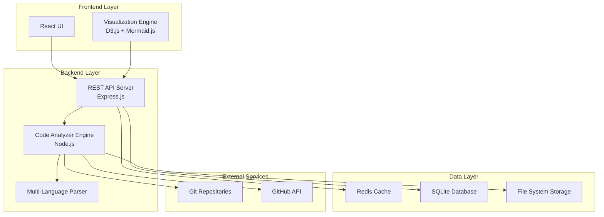

# Design Document

## Overview

Project Atlas는 Git 저장소를 자동으로 분석하여 프로젝트 구조, 서비스 의존성, API 호출 관계를 시각화하는 웹 기반 도구입니다. 마이크로서비스 아키텍처와 복잡한 프로젝트 구조를 직관적으로 이해할 수 있도록 돕는 것이 목표입니다.

## Architecture

### High-Level Architecture



### Component Architecture

시스템은 다음과 같은 주요 컴포넌트로 구성됩니다:

1. **Frontend (React + TypeScript)**
   - 사용자 인터페이스
   - 대화형 시각화 컴포넌트
   - 프로젝트 관리 대시보드

2. **Backend API Server (Express.js)**
   - RESTful API 엔드포인트
   - 인증 및 권한 관리
   - 요청 라우팅 및 응답 처리

3. **Code Analysis Engine (Node.js)**
   - Git 저장소 클로닝 및 분석
   - 언어별 파서 통합
   - 의존성 그래프 생성

4. **Data Storage**
   - SQLite: 분석 결과 및 메타데이터
   - Redis: 캐싱 및 세션 관리
   - File System: 임시 저장소 파일

## Components and Interfaces

### 1. Frontend Components

#### Main Dashboard
- **ProjectList**: 분석된 프로젝트 목록 표시
- **AnalysisStatus**: 실시간 분석 진행 상황
- **QuickActions**: 새 프로젝트 추가, 재분석 등

#### Visualization Components
- **ServiceGraph**: 서비스 간 의존성 그래프 (D3.js)
- **APIFlowDiagram**: API 호출 흐름도 (Mermaid.js)
- **TechStackOverview**: 기술 스택 통계 차트
- **DependencyMatrix**: 의존성 매트릭스 뷰

#### Analysis Results
- **ComponentReport**: 검출된 컴포넌트 상세 정보
- **APIEndpoints**: API 엔드포인트 목록
- **DatabaseConnections**: DB 연결 정보
- **EnvironmentVariables**: 환경 변수 목록

### 2. Backend API Endpoints

```typescript
// 프로젝트 관리
POST   /api/projects              // 새 프로젝트 추가
GET    /api/projects              // 프로젝트 목록 조회
GET    /api/projects/:id          // 특정 프로젝트 조회
DELETE /api/projects/:id          // 프로젝트 삭제

// 분석 관리
POST   /api/projects/:id/analyze  // 프로젝트 분석 시작
GET    /api/projects/:id/status   // 분석 상태 조회
GET    /api/projects/:id/results  // 분석 결과 조회

// 시각화 데이터
GET    /api/projects/:id/graph    // 의존성 그래프 데이터
GET    /api/projects/:id/apis     // API 엔드포인트 데이터
GET    /api/projects/:id/tech     // 기술 스택 통계

// 내보내기
GET    /api/projects/:id/export   // 결과 내보내기 (JSON/CSV/PDF)
```

### 3. Code Analysis Engine

#### Repository Analyzer
```typescript
interface RepositoryAnalyzer {
  cloneRepository(url: string): Promise<string>
  scanDirectory(path: string): Promise<FileStructure>
  detectFrameworks(files: FileInfo[]): Promise<Framework[]>
  extractDependencies(files: FileInfo[]): Promise<Dependency[]>
}
```

#### Language Parsers
- **JavaScriptParser**: React, Vue, Node.js 프로젝트 분석
- **PythonParser**: Django, Flask, FastAPI 프로젝트 분석
- **ConfigParser**: package.json, requirements.txt, docker-compose.yml 등
- **EnvironmentParser**: .env 파일 및 환경 변수 추출

#### Dependency Extractor
```typescript
interface DependencyExtractor {
  extractAPICall(code: string, language: string): APICall[]
  extractDatabaseConnection(code: string): DatabaseConnection[]
  extractServiceCall(code: string): ServiceCall[]
  buildDependencyGraph(dependencies: Dependency[]): DependencyGraph
}
```

## Data Models

### Core Data Models

```typescript
// 프로젝트 정보
interface Project {
  id: string
  name: string
  repositoryUrl: string
  repositoryType: 'single' | 'multi'
  status: 'pending' | 'analyzing' | 'completed' | 'failed'
  createdAt: Date
  updatedAt: Date
  lastAnalyzedAt?: Date
}

// 분석 결과
interface AnalysisResult {
  projectId: string
  structure: ProjectStructure
  dependencies: Dependency[]
  apis: APIEndpoint[]
  databases: DatabaseConnection[]
  frameworks: Framework[]
  metrics: ProjectMetrics
}

// 프로젝트 구조
interface ProjectStructure {
  directories: Directory[]
  files: FileInfo[]
  languages: LanguageStats[]
  frameworks: Framework[]
}

// 의존성 정보
interface Dependency {
  id: string
  source: string
  target: string
  type: 'api' | 'database' | 'service' | 'library'
  method?: string
  endpoint?: string
  confidence: number
}

// API 엔드포인트
interface APIEndpoint {
  id: string
  method: 'GET' | 'POST' | 'PUT' | 'DELETE' | 'PATCH'
  path: string
  source: string
  lineNumber: number
  parameters?: Parameter[]
  responses?: Response[]
}

// 프레임워크 정보
interface Framework {
  name: string
  version?: string
  type: 'frontend' | 'backend' | 'database' | 'build' | 'test'
  confidence: number
  files: string[]
}
```

### Database Schema

```sql
-- 프로젝트 테이블
CREATE TABLE projects (
  id TEXT PRIMARY KEY,
  name TEXT NOT NULL,
  repository_url TEXT NOT NULL,
  repository_type TEXT CHECK(repository_type IN ('single', 'multi')),
  status TEXT CHECK(status IN ('pending', 'analyzing', 'completed', 'failed')),
  created_at DATETIME DEFAULT CURRENT_TIMESTAMP,
  updated_at DATETIME DEFAULT CURRENT_TIMESTAMP,
  last_analyzed_at DATETIME
);

-- 분석 결과 테이블
CREATE TABLE analysis_results (
  id TEXT PRIMARY KEY,
  project_id TEXT REFERENCES projects(id),
  result_data JSON NOT NULL,
  created_at DATETIME DEFAULT CURRENT_TIMESTAMP
);

-- 의존성 테이블
CREATE TABLE dependencies (
  id TEXT PRIMARY KEY,
  project_id TEXT REFERENCES projects(id),
  source TEXT NOT NULL,
  target TEXT NOT NULL,
  type TEXT NOT NULL,
  method TEXT,
  endpoint TEXT,
  confidence REAL,
  created_at DATETIME DEFAULT CURRENT_TIMESTAMP
);
```

## Error Handling

### Error Categories

1. **Repository Access Errors**
   - 잘못된 Git URL
   - 접근 권한 부족
   - 네트워크 연결 오류

2. **Analysis Errors**
   - 지원하지 않는 언어/프레임워크
   - 파일 파싱 오류
   - 메모리 부족

3. **Visualization Errors**
   - 데이터 로딩 실패
   - 렌더링 오류
   - 브라우저 호환성 문제

### Error Handling Strategy

```typescript
// 에러 응답 표준화
interface ErrorResponse {
  error: {
    code: string
    message: string
    details?: any
    timestamp: string
  }
}

// 재시도 메커니즘
class RetryableOperation {
  async execute<T>(
    operation: () => Promise<T>,
    maxRetries: number = 3,
    backoffMs: number = 1000
  ): Promise<T> {
    // 지수 백오프를 사용한 재시도 로직
  }
}

// 부분 결과 처리
interface PartialAnalysisResult {
  completed: string[]
  failed: string[]
  results: Partial<AnalysisResult>
  errors: AnalysisError[]
}
```

## Testing Strategy

### Unit Testing
- **Frontend**: Jest + React Testing Library
- **Backend**: Jest + Supertest
- **Analysis Engine**: Jest + Mock 파일 시스템

### Integration Testing
- API 엔드포인트 통합 테스트
- 데이터베이스 연동 테스트
- Git 저장소 분석 통합 테스트

### End-to-End Testing
- Playwright를 사용한 전체 워크플로우 테스트
- 실제 오픈소스 프로젝트를 사용한 분석 테스트

### Performance Testing
- 대용량 저장소 분석 성능 테스트
- 동시 분석 요청 처리 테스트
- 메모리 사용량 모니터링

### Test Data Strategy
```typescript
// 테스트용 샘플 프로젝트
const testProjects = {
  simpleReact: 'https://github.com/test/simple-react-app',
  microservices: 'https://github.com/test/microservices-demo',
  fullstack: 'https://github.com/test/fullstack-app'
}

// Mock 분석 결과
const mockAnalysisResult: AnalysisResult = {
  projectId: 'test-project',
  structure: { /* ... */ },
  dependencies: [ /* ... */ ],
  // ...
}
```

## Performance Considerations

### Scalability Requirements
- 10,000개 이상의 파일을 가진 저장소 분석 지원
- 동시에 최대 10개 프로젝트 분석 처리
- 5분 이내 분석 완료 (중간 규모 프로젝트 기준)

### Optimization Strategies
1. **스트리밍 분석**: 대용량 파일을 청크 단위로 처리
2. **병렬 처리**: Worker 스레드를 사용한 파일 분석
3. **캐싱**: Redis를 사용한 분석 결과 캐싱
4. **지연 로딩**: 시각화 데이터의 점진적 로딩

### Resource Management
```typescript
// 메모리 사용량 모니터링
class ResourceMonitor {
  checkMemoryUsage(): number
  enforceMemoryLimit(limitMB: number): void
  cleanupTempFiles(): void
}

// 분석 작업 큐
class AnalysisQueue {
  addJob(projectId: string, priority: number): void
  processJobs(concurrency: number): void
  getQueueStatus(): QueueStatus
}
```